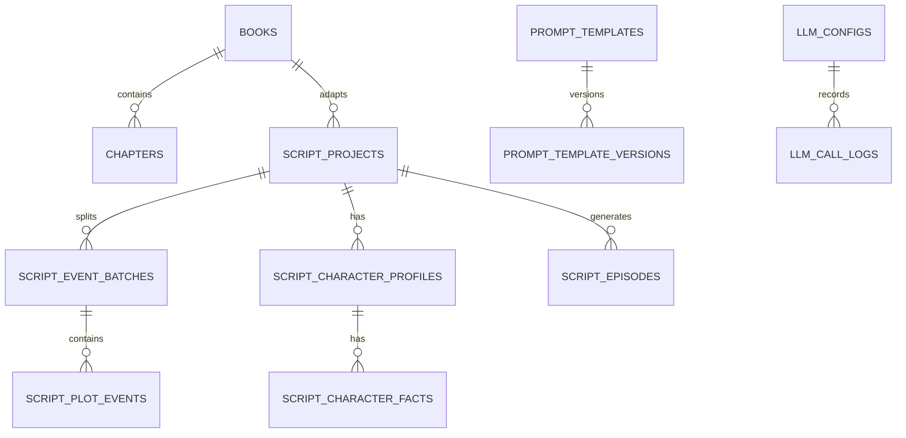

# 数据库设计文档

## 1. 概述

数据库使用 PostgreSQL。核心数据包括小说作品、章节、剧本改编项目、剧情事件批次、剧情事件、人物档案、人物特征事实、分集剧本、大模型配置、提示词模板、提示词版本、调用日志和导出记录。

历史模块 `chapter_summaries`、`story_profiles`、`generation_tasks`、`script_segments` 已废弃，不属于当前结项版本。

## 2. 表清单

| 表名 | 说明 |
| --- | --- |
| users | 用户预留表 |
| books | 小说作品 |
| chapters | 小说章节 |
| script_projects | 剧本改编项目 |
| script_event_batches | 剧情事件拆分批次 |
| script_plot_events | 剧情事件 |
| script_character_profiles | 人物档案 |
| script_character_facts | 人物特征事实 |
| script_episodes | 分集剧本 |
| llm_configs | 大模型配置 |
| prompt_templates | 提示词模板 |
| prompt_template_versions | 提示词版本 |
| llm_call_logs | 大模型调用日志 |
| export_records | 导出记录 |

## 3. users

| 字段 | 类型 | 说明 |
| --- | --- | --- |
| id | BIGSERIAL | 主键 |
| username | VARCHAR(100) | 用户名，唯一 |
| password_hash | VARCHAR(255) | 密码哈希，当前未启用 |
| nickname | VARCHAR(100) | 昵称 |
| email | VARCHAR(255) | 邮箱 |
| created_at | TIMESTAMP | 创建时间 |
| updated_at | TIMESTAMP | 更新时间 |
| is_deleted | BOOLEAN | 软删除 |

## 4. books

| 字段 | 类型 | 说明 |
| --- | --- | --- |
| id | BIGSERIAL | 主键 |
| user_id | BIGINT | 预留用户 ID |
| title | VARCHAR(255) | 作品名称 |
| original_filename | VARCHAR(255) | 原始文件名 |
| source_type | VARCHAR(50) | text/file |
| novel_type | VARCHAR(50) | short/middle/long |
| word_count | INTEGER | 总字数 |
| chapter_count | INTEGER | 章节数 |
| preprocess_status | VARCHAR(50) | 预处理状态，当前用于上传完成标记 |
| error_message | TEXT | 错误信息 |
| created_at | TIMESTAMP | 创建时间 |
| updated_at | TIMESTAMP | 更新时间 |
| deleted_at | TIMESTAMP | 删除时间 |
| is_deleted | BOOLEAN | 软删除 |

删除小说时同步软删除章节和关联剧本改编数据。

## 5. chapters

| 字段 | 类型 | 说明 |
| --- | --- | --- |
| id | BIGSERIAL | 主键 |
| book_id | BIGINT | 作品 ID |
| chapter_index | INTEGER | 章节序号 |
| title | VARCHAR(255) | 章节标题 |
| content | TEXT | 章节正文 |
| word_count | INTEGER | 字数 |
| created_at | TIMESTAMP | 创建时间 |
| updated_at | TIMESTAMP | 更新时间 |
| is_deleted | BOOLEAN | 软删除 |

## 6. script_projects

| 字段 | 类型 | 说明 |
| --- | --- | --- |
| id | BIGSERIAL | 主键 |
| user_id | BIGINT | 预留用户 ID |
| book_id | BIGINT | 来源小说 |
| project_name | VARCHAR(255) | 项目名称 |
| script_type | VARCHAR(100) | tv/short_drama/animation/audio_drama |
| default_style | VARCHAR(100) | 改编类型中文标签 |
| default_compression_level | VARCHAR(50) | 预留字段 |
| default_target_duration | INTEGER | 单集目标时长 |
| pacing | VARCHAR(50) | fast/medium/slow |
| scene_frequency | VARCHAR(50) | high/medium/low |
| dialogue_density | VARCHAR(50) | high/medium/low |
| events_per_episode | INTEGER | 每集事件数 |
| yaml_schema_delta | JSONB | 不同剧本类型的 YAML 差分 |
| split_status | VARCHAR(50) | idle/running/stopped |
| split_stop_requested | BOOLEAN | 剧情拆分停止标记 |
| generation_status | VARCHAR(50) | idle/running/stopped |
| generation_stop_requested | BOOLEAN | 剧集生成停止标记 |
| status | VARCHAR(50) | 项目状态 |
| created_at | TIMESTAMP | 创建时间 |
| updated_at | TIMESTAMP | 更新时间 |
| deleted_at | TIMESTAMP | 删除时间 |
| is_deleted | BOOLEAN | 软删除 |

## 7. script_event_batches

| 字段 | 类型 | 说明 |
| --- | --- | --- |
| id | BIGSERIAL | 主键 |
| project_id | BIGINT | 剧本项目 ID |
| book_id | BIGINT | 来源小说 ID |
| batch_index | INTEGER | 批次序号 |
| chapter_start_index | INTEGER | 起始章节 |
| chapter_end_index | INTEGER | 结束章节 |
| status | VARCHAR(50) | 批次状态 |
| raw_response | JSONB | 模型原始结构化响应 |
| created_at | TIMESTAMP | 创建时间 |
| updated_at | TIMESTAMP | 更新时间 |

当前策略为每 3 章一个批次。

## 8. script_plot_events

| 字段 | 类型 | 说明 |
| --- | --- | --- |
| id | BIGSERIAL | 主键 |
| project_id | BIGINT | 剧本项目 ID |
| batch_id | BIGINT | 拆分批次 ID |
| event_index | INTEGER | 全剧本剧情事件序号 |
| content | TEXT | 剧情事件内容 |
| source_chapter_start | INTEGER | 来源章节起始 |
| source_chapter_end | INTEGER | 来源章节结束 |
| locked | BOOLEAN | 是否已用于剧集生成 |
| created_at | TIMESTAMP | 创建时间 |
| updated_at | TIMESTAMP | 更新时间 |
| deleted_at | TIMESTAMP | 删除时间 |
| is_deleted | BOOLEAN | 软删除 |

## 9. script_character_profiles

| 字段 | 类型 | 说明 |
| --- | --- | --- |
| id | BIGSERIAL | 主键 |
| project_id | BIGINT | 剧本项目 ID |
| name | VARCHAR(255) | 人物名称 |
| profile | TEXT | 当前人物档案 |
| metadata_json | JSONB | 结构化元数据，如 AI 整合档案 |
| created_at | TIMESTAMP | 创建时间 |
| updated_at | TIMESTAMP | 更新时间 |
| deleted_at | TIMESTAMP | 删除时间 |
| is_deleted | BOOLEAN | 软删除 |

## 10. script_character_facts

| 字段 | 类型 | 说明 |
| --- | --- | --- |
| id | BIGSERIAL | 主键 |
| project_id | BIGINT | 剧本项目 ID |
| character_id | BIGINT | 人物 ID |
| batch_id | BIGINT | 来源拆分批次 |
| fact_type | VARCHAR(100) | 特征类型 |
| content | TEXT | 特征内容 |
| normalized_content | VARCHAR(500) | 去重用标准化文本 |
| status | VARCHAR(50) | active |
| created_at | TIMESTAMP | 创建时间 |
| updated_at | TIMESTAMP | 更新时间 |
| deleted_at | TIMESTAMP | 删除时间 |
| is_deleted | BOOLEAN | 软删除 |

## 11. script_episodes

| 字段 | 类型 | 说明 |
| --- | --- | --- |
| id | BIGSERIAL | 主键 |
| project_id | BIGINT | 剧本项目 ID |
| episode_index | INTEGER | 分集序号 |
| title | VARCHAR(255) | 分集标题 |
| event_ids | JSONB | 使用的剧情事件数据库 ID |
| yaml_content | TEXT | 剧集 YAML |
| plain_text_content | TEXT | 渲染后的 TXT |
| status | VARCHAR(50) | completed/draft |
| created_at | TIMESTAMP | 创建时间 |
| updated_at | TIMESTAMP | 更新时间 |
| deleted_at | TIMESTAMP | 删除时间 |
| is_deleted | BOOLEAN | 软删除 |

`yaml_content` 中的 `script.metadata.episode_number` 必须与 `episode_index` 一致。

## 12. llm_configs

| 字段 | 类型 | 说明 |
| --- | --- | --- |
| id | BIGSERIAL | 主键 |
| provider | VARCHAR(100) | 供应商 |
| base_url | VARCHAR(500) | OpenAI 兼容 Base URL |
| api_key_encrypted | TEXT | 加密 API Key |
| api_key_masked | VARCHAR(100) | 掩码 |
| model_name | VARCHAR(100) | 模型名称 |
| temperature | NUMERIC(4,2) | 温度 |
| top_p | NUMERIC(4,2) | top_p |
| max_tokens | INTEGER | 最大 token |
| timeout_seconds | INTEGER | 超时秒数 |
| retry_count | INTEGER | 重试次数 |
| task_scope | JSONB | 适用任务类型 |
| is_default | BOOLEAN | 默认配置 |
| enabled | BOOLEAN | 启用状态 |
| created_at | TIMESTAMP | 创建时间 |
| updated_at | TIMESTAMP | 更新时间 |
| is_deleted | BOOLEAN | 软删除 |

## 13. prompt_templates

| 字段 | 类型 | 说明 |
| --- | --- | --- |
| id | BIGSERIAL | 主键 |
| template_name | VARCHAR(255) | 模板名称 |
| task_type | VARCHAR(100) | 任务类型 |
| system_prompt | TEXT | 系统提示词 |
| user_prompt_template | TEXT | 用户提示词模板 |
| output_format | VARCHAR(50) | json/yaml/text |
| variables | JSONB | 变量名 |
| version | INTEGER | 当前版本 |
| enabled | BOOLEAN | 启用状态 |
| created_at | TIMESTAMP | 创建时间 |
| updated_at | TIMESTAMP | 更新时间 |
| is_deleted | BOOLEAN | 软删除 |

## 14. prompt_template_versions

| 字段 | 类型 | 说明 |
| --- | --- | --- |
| id | BIGSERIAL | 主键 |
| template_id | BIGINT | 模板 ID |
| version | INTEGER | 版本号 |
| system_prompt | TEXT | 系统提示词 |
| user_prompt_template | TEXT | 用户提示词模板 |
| output_format | VARCHAR(50) | 输出格式 |
| variables | JSONB | 变量 |
| created_at | TIMESTAMP | 创建时间 |

## 15. llm_call_logs

| 字段 | 类型 | 说明 |
| --- | --- | --- |
| id | BIGSERIAL | 主键 |
| llm_config_id | BIGINT | 模型配置 ID |
| prompt_template_id | BIGINT | 提示词模板 ID |
| task_type | VARCHAR(100) | 任务类型 |
| request_summary | TEXT | 请求摘要 |
| response_summary | TEXT | 响应摘要 |
| input_tokens | INTEGER | 输入 token |
| output_tokens | INTEGER | 输出 token |
| total_tokens | INTEGER | 总 token |
| status | VARCHAR(50) | success/failed |
| error_message | TEXT | 错误信息 |
| latency_ms | INTEGER | 耗时 |
| created_at | TIMESTAMP | 创建时间 |

## 16. export_records

| 字段 | 类型 | 说明 |
| --- | --- | --- |
| id | BIGSERIAL | 主键 |
| user_id | BIGINT | 预留用户 ID |
| project_id | BIGINT | 剧本项目 ID |
| export_type | VARCHAR(50) | episode/all |
| file_format | VARCHAR(50) | yaml/txt |
| file_path | VARCHAR(500) | 导出文件名 |
| created_at | TIMESTAMP | 创建时间 |

## 17. 关系

## 18. 初始化与清理脚本

- `sql/init.sql`：结项版本全量建库脚本。
- `sql/update_default_prompt_templates_zh.sql`：更新默认提示词模板。
- `sql/cleanup_legacy_bookshelf.sql`：清理旧小说摘要/设定模块。
- `sql/cleanup_legacy_script_flow.sql`：清理旧剧本任务和片段模块。
- `sql/upgrade_script_adaptation_workflow.sql`、`sql/upgrade_script_character_facts.sql`：历史增量升级脚本，保留用于老库升级。
