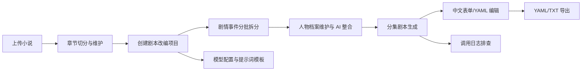

# AI 小说剧本改编辅助系统需求文档

## 1. 项目定位

本项目是面向中文小说改编的 Web 工作台，用于把已上传的小说章节逐步整理为可编辑、可导出的分集剧本。系统重点覆盖作品上传、章节维护、剧情事件拆分、人物档案维护、分集剧本生成、剧本编辑导出、大模型配置、提示词模板和调用日志排查。

系统不包含正式权限用户体系；当前用户字段仅作为数据模型预留。

## 2. 用户角色

- 内容创作者：上传小说，检查章节切分结果，启动剧本改编。
- 编剧/改编人员：维护剧情事件、人物档案、分集剧本和导出内容。
- 系统配置人员：配置 OpenAI 兼容大模型 API、提示词模板和调用日志。

## 3. 技术栈

- 后端：FastAPI、SQLAlchemy 2、Pydantic 2、PostgreSQL、psycopg、PyYAML。
- 大模型调用：LangChain、langchain-openai，兼容 OpenAI Chat Completions 格式，可接入 DeepSeek 等供应商。
- 前端：Vue 3、Vue Router、Vite、Element Plus、Axios。
- 安全：API Key 使用 Fernet 加密后入库；`.env` 不进入版本库。

## 4. 当前业务流程

## 5. 功能需求

### 5.1 工作台

- 展示当前系统三步流程：上传小说、改编剧本、导出与排查。
- 提供快捷按钮跳转到小说书架、剧本生成和模型配置。

### 5.2 小说书架

- 支持文本输入上传小说。
- 支持 `.txt` 文件上传，自动读取 UTF-8，失败时兼容 GB18030。
- 自动按章节标题切分小说；无章节标题时生成单章“正文”。
- 左侧展示作品列表，右侧展示章节表格。
- 支持新增章节、编辑章节标题和正文、删除章节。
- 支持删除小说；删除小说时软删除其章节和关联剧本改编项目数据。
- 不再包含章节摘要、故事设定档案或相关 AI 生成功能。

### 5.3 剧本改编项目

- 基于小说创建剧本改编项目。
- 创建时选择改编类型：电视剧、短剧、动画、广播剧。
- 创建时设置单集时长、剧情节奏、场景切换频率、对话密度、每集剧情事件数。
- 改编类型初始化后不可修改；其他参数可通过参数配置调整。
- 删除剧本改编项目时软删除相关批次、事件、人物档案、人物特征和剧集。

### 5.4 剧情事件拆分

- 以 3 章为一个拆分批次。
- 支持单次拆分、全部拆分和安全停止拆分。
- 全部拆分会按批次多次调用模型；安全停止在当前批次结束后停止后续调用。
- 每个批次包含若干剧情事件；事件按全剧本 `event_index` 排序。
- 事件可编辑和删除；已用于剧集生成的事件会锁定，不能再编辑或删除。
- 拆分时同步提取人物增量事实（`facts`），统一使用 `fact_type` + `content` 字段。
- 人物信息以增量方式写入人物事实表，后端进行标准化和去重后组装当前人物档案。
- **人物别名提取**：拆分提示词要求模型输出 `aliases` 字段，记录原文中的其他明确称呼，后端合并写入 `metadata_json.aliases`。人物匹配时同时检查标准名称和别名，避免因称呼不同创建重复人物。
- **事实类型约束**：`fact_type` 限为 9 类（身份、外貌、性格、能力、物品、关系、立场、目标、当前状态），后端 `output_contract` 明确列出 `allowed_fact_types`。
- **事件粒度控制**：提示词要求提取"可独立用于剧本场景编排的剧情节点"，同一时间、地点和目标下连续动作应合并，避免过度拆分。

### 5.5 人物模块

- 展示随剧情拆分更新的人物档案。
- 支持手动编辑人物名称、档案正文和元数据（含别名列表）。
- 支持 AI 一键整合人物档案，将拆分阶段累积的结构化特征整合为简洁档案。
- **人物事实按时序整合**：每个人的 `facts` 按剧情发生顺序排列，列表中越靠后的事实越新。整合提示词据此区分历史状态与当前状态，不会将"正在恢复"和"已经恢复"混写为同时成立的当前状态。
- **别名匹配**：人物匹配时同时检查标准名和 `metadata_json.aliases`，避免因称呼不同创建重复人物。

### 5.6 剧本生成模块

- 按已生成且未锁定的剧情事件生成分集剧本。
- 用户设置每集使用多少剧情事件；不足一集额度时不继续生成。
- 支持单集生成、全部生成和安全停止生成。
- 每一集是一次独立模型调用。
- **输入职责分层**：
  - 剧情事件决定本集必须表现的剧情范围、因果和顺序。
  - 原文章节只用于补充动作、环境、情绪和对白细节。
  - 人物档案只用于约束人物身份、性格、能力、关系、称呼和当前状态。
  - 改编配置用于控制场景数量、节奏、对白比例和结尾形式。
- **单集人物筛选**：生成一集时只传入该集事件和章节中实际相关的人物（通过名称/别名匹配），而非全项目人物，控制上下文体积。
- **改编参数明确化**：模糊标签（快/中/慢）自动推导为具体数值范围（`target_scene_count`、`dialogue_ratio`、`scene_length_hint`、`ending_requirement`）。
- 被使用的剧情事件会锁定，不能再次参与新剧集生成。
- **生成-修复流程**：生成 → YAML解析 → 结构规范化 → 业务校验 → 失败则调用修复任务 → 再校验 → 仍失败使用兜底。修复最多调用一次。
- **修复支持**：修复模板可处理 YAML 解析错误（`YAML_PARSE_ERROR`）和业务校验错误；优先修复格式/结构/事件引用，不得新增剧情。
- **字段类型约束**：`action` 为字符串数组，`dialogue` 为对象数组（`speaker` + `line`），`transition` 为字符串。
- 剧集 YAML 的 `metadata` 由后端强制规范化，固定包含：
  - `format`
  - `title`
  - `episode_number`
  - `source_book_title`
  - `adaptation_type`
  - `episode_duration`
  - `pacing`
  - `scene_frequency`
  - `dialogue_density`
- 剧集标题只保留剧情主题，不包含小说名、剧名或”第几集”。
- 前端提供中文表单编辑和 YAML 源码编辑两种方式。
- 中文表单中的场景默认折叠，点击后展开；场景、动作、对白均可编辑。

### 5.7 剧本导出

- 支持单集导出和全部导出。
- 支持 YAML 和 TXT。
- TXT 基于 YAML 渲染为中文阅读文本，而不是直接返回 YAML 或占位文本。

### 5.8 大模型配置

- 支持新增、编辑、删除模型配置。
- 支持设置默认配置。
- 支持测试连接。
- 支持任务范围限定。
- API Key 加密保存，前端只显示掩码。

### 5.9 提示词模板

- 支持初始化默认提示词模板。
- 支持按任务类型、启用状态、关键词筛选。
- 支持新增、编辑、删除、启停。
- 支持版本查看和回滚。
- 当前默认任务类型：
  - `plot_event_split_generation` — 剧情事件拆分，提取剧情节点和人物增量事实（含别名）
  - `script_episode_generation` — 单集剧本生成，以剧情事件为范围、原文章节为细节、人物档案为约束
  - `character_profile_consolidation` — 人物档案整合，按时序事实区分历史状态与当前状态
  - `script_episode_repair` — 单集剧本修复，修复 YAML 解析和业务校验错误，不新增剧情
- 默认模板名称统一为中文，模板文件与数据库升级 SQL 保持同步。

### 5.10 调用日志

- 支持查看大模型调用列表和详情。
- 记录任务类型、状态、耗时、Token 用量、请求摘要、响应摘要和错误信息。
- 支持一键清空日志。

## 6. 非功能需求

- 主分支保持可运行。
- 数据删除使用软删除，避免误操作立即破坏核心数据。
- 模型输出必须经过后端校验、清洗和兜底处理。
- 生产环境不得提交真实 `.env`、API Key、数据库密码或运行日志。
- 后端提供健康检查接口 `/api/health` 和 `/api/health/db`。

## 7. 已移除范围

- 章节摘要生成。
- 故事设定档案生成与编辑。
- 旧剧本任务流水线、旧剧本片段接口、旧导出接口。
- Demo guide 和演示数据 seed 入口。

## 8. 验收路径

1. 初始化数据库并启动前后端。
2. 在模型配置页新增 DeepSeek 或其他 OpenAI 兼容配置。
3. 初始化默认提示词模板。
4. 在小说书架上传小说并检查章节切分。
5. 在剧本生成页创建改编项目。
6. 执行剧情事件拆分并检查人物档案。
7. 生成单集剧本，检查 YAML `metadata` 与中文表单映射。
8. 导出 YAML 和 TXT。
9. 在调用日志页检查模型请求记录。
